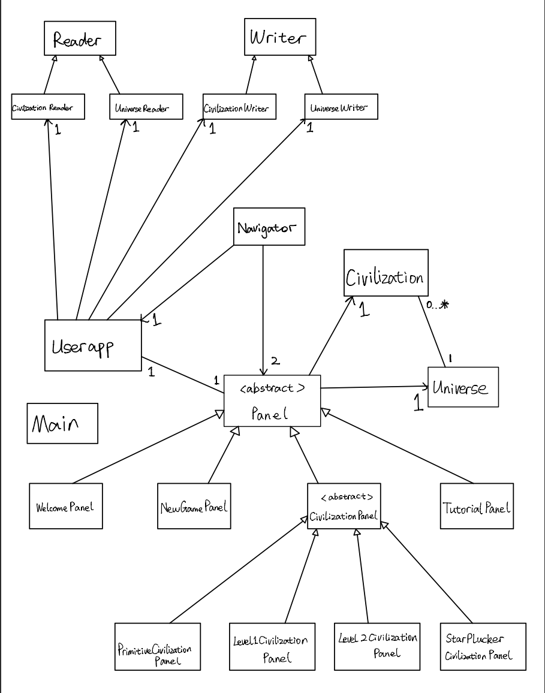

# Dark Forest

## A strategy game inspired by Three Body Problem

This is a strategy game based on the **Dark Forest Principle**--the universe is like a dark and cold
forest, all civilizations are like hunters trying to hide themselves and kill any spotted enemy hunters.
Player will be given a new primitive civilization which is unknown to the rest of the universe. Player
will gain certain amounts of development points that can be used to develop technology,society and culture 
each time unit.After a certain time or a certain development level players will encounter other civilizations
either proactively or passively depends on the details of the development of player's civilization. Based on 
the **Dark Forest Principle** the two civilization will only try to destroy each other and only one civilization
will survive. The goal of the player is to survive as long as possible, and eliminate all other civilizations.

Anyone could play this game, especially those who has read the Liu Cixin's Three Body Problem.I'm very
interested in the book and dark forest principle. That's the main motivation that trigger me to do this project.

    

A *bulleted* list:
- As a user, I want to have a primitive civilization every time I start a new game.
- As a user, I want to customize the size of enemy civilizations and add them to the Universe class(to make this game 
  fair,enemy civilizations' details information is randomly formed. Players can only determine the number of enemy 
  civilizations in this universe)
- As a user, I want to be assigned a certain amounts of development points each time unit.
- As a user, I want to be able to add development points to one of three fields, namely, technology,society and 
  culture.
- As a user, I want to be able to make decision each time unit about whether should I proactively reach out to 
  other civilizations after a certain level of technology.
- As a user, I want to be able to make my own choices which could influence the gaming process.
- As a user, I want to be able to end one time unit after I've finished all my action.
- As a user, I want be able to record how many time units I've survived after my civilization's been destroyed, and be 
  able to choose whether to start a new round of game or not.
- As a user, I want to be able to choose to quit at the end of each round and store my current gaming process.
- As a user, at the welcome panel, I want to have an option to reload my stored state of the gaming process.
  
#PHASE 4: TASK 2
- Design and test a robust class: civilization class 
                           methods: civilDevelopment(t,s,c)
- Type hierarchy: In persistence package, subclass "CivilizationReader" and "UniverseReader" extends super class "Reader"
  subclass "CivilizationWriter" and "UniverseWriter" extend super class "Writer"
  In ui package, subclass "CivilizationPanel","NewGamePanel", "TutorialPanel" and "WelcomePanel" extend abstract "Panel".
  Additionally, "CivilizationPanel" is extended by "PrimitiveCivilizationPanel","Level1CivilizationPanel",
  "Level2CivilizationPanel" and "StarPluckerPanel" 
 
#PHASE 4 : TASK 3

